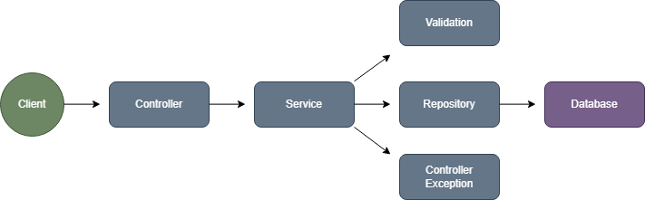

<h1 align="center">To-Do-API</h1>

### 🎯 **OBJETIVO**

>O To-Do é uma **API RESTful** desenvolvida em **Java** com **Spring Boot** para facilitar a gestão de tarefas. O projeto tem como finalidade permitir o gerenciamento eficiente de tarefas.

>A API foi construída seguindo boas práticas de desenvolvimento limpo (Clean Code), utilizando Spring Data JPA para a persistência dos dados e JUnit para garantir a qualidade do código por meio de testes automatizados.

#
### 💻 **TECNOLOGIAS**

&nbsp;
&nbsp;
&nbsp;
&nbsp;
&nbsp;
&nbsp;
&nbsp;

#
### 🔧 **FUNCIONALIDADES**

- **Cadastro de Tarefas:** Permite a criação de novas tarefas com título, descrição e status inicial.

- **Exclusão de Tarefas:** Remove uma tarefa existente do banco de dados.

- **Atualização de Status:** Permite modificar o status de uma tarefa (ex: "Pendente" → "Concluída").

- **Busca por ID:**  Recupera os detalhes de uma tarefa específica a partir do seu identificador único.

- **Listagem de Tarefas:** Retorna todas as tarefas cadastradas no sistema.

- **Persistência de Dados:** Utiliza Spring Data JPA para armazenar as tarefas em um banco de dados relacional (H2, MySQL ou PostgreSQL).

- **Testes Automatizados:** Implementação de testes unitários com JUnit para garantir o correto funcionamento dos serviços e endpoints da API.

#
### 🔄 **REPRESENTAÇÃO DE FLUXO**

> A representação de fluxo visa graficamente ilustrar o comportamento da aplicação em nível arquitetural, destacando os principais recursos empregados para assegurar o funcionamento eficiente do serviço.

<div align="center">
  
</div>

#
### 📌 **REQUISITOS**

Para executar nossa plataforma localmente, é necessário ter em seu dispositivo computacional:

  1. Certifique-se que instalou a versão **17 do Java**.  [Baixe aqui](https://www.oracle.com/java/technologies/javase/jdk17-archive-downloads.html)

  2. Certifique-se de que tenha instalado alguma **IDE** em sua máquina. [Baixe aqui](https://www.jetbrains.com/idea/download/?section=windows)

  3. Certifique-se de que tenha o **PostgreSQL** intalado. [Baixe aqui](https://www.postgresql.org/download/)

#
### ⬇️ **DOWNLOAD DO PROJETO**

Baixe o projeto em seu computador através do comando:

```bash
git clone https://github.com/Kauan-Ts16/Teste-Tecnico-Solutis.git
```

**ou**

1. Clique em `<> Code`.
2. Faça o download do arquivo ZIP.
3. Abra o seu explorador de arquivos na localização da instalação.
4. Extraia o arquivo ZIP.

#
### ▶️ **EXECUÇÃO**

Sequência de execução do projeto:

```
1. Acesse a IDE na qual deseja executar o projeto.
2. Clique em "Abrir um projeto já existente".
3. Selecione o local da pasta descompactada do projeto.
4. Confirme a seleção.
5. Crie um banco de dados ou utilize um de teste.
6. Altere o arquivo "application.properties" com o nome do banco e a senha.
7. Localize e clique no botão "Play" (verde) localizado na parte superior da IDE.
8. Um terminal integrado será aberto.
9. Aguarde a instalação das dependências do projeto.
10. Após a conclusão das instalações, o projeto será executado.

VOCÊ PODE TESTAR A APLICAÇÃO ACESSANDO A URL DO ULTÍMO TÓPICO

```

#
### 🌐 DOMÍNIO DA API

```
http://localhost:8080
```

#
### 📚 DOCUMENTAÇAO DA API

```
http://localhost:8080/swagger-ui/index.html
```